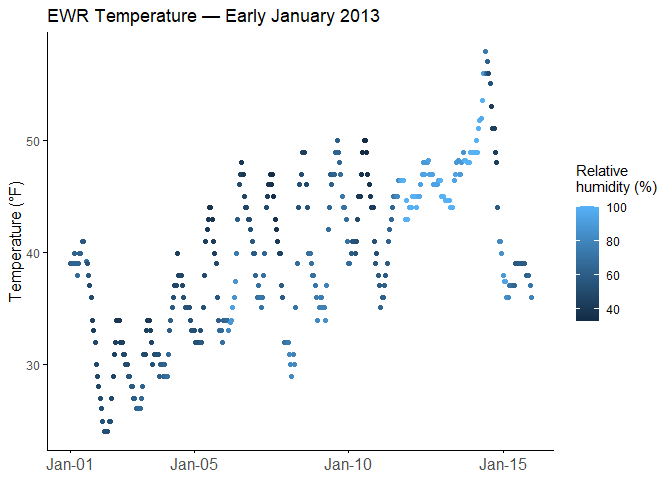

Simple document
================
Heng Hu (hh2648)
2025-09-14

Load packages

``` r
library(tidyverse)
library(moderndive)
```

## Problem 1

``` r
# Load the dataset
data("early_january_weather")

# Explorer the dataset
var_nms <- names(early_january_weather)
origin <- unique(early_january_weather$origin)
yr <- unique(early_january_weather$year)
day_min <- min(early_january_weather$day)
day_max <- max(early_january_weather$day)
```

#### a. Description of the dataset:

This dataset has `15` variables and `358` observations. The variables’
names are
`origin, year, month, day, hour, temp, dewp, humid, wind_dir, wind_speed, wind_gust, precip, pressure, visib, time_hour`.The
`origin` variable indicates the data was collected from `EWR`, which is
Newark Liberty International Airport. According to `year`, `month`, and
`day` variables, we know that the observations were collected from
`Jan 1, 2013` to `Jan 15, 2013`.

`visib` is visibility in miles. It is a critical parameter for airport
operations. The mean visibility in this dataset is `8.5` miles, with a
standard deviation of `3` miles.

`wind_speed` is the speed of wind in MPH. It is another critical
parameter for airport operations. The mean wind speed in this dataset is
`8.2` miles, with a standard deviation of `4.6` miles.

In winter, temperature is also important for the airport. The mean
temperature in early Januray, 2013 is `7.1` F.

#### b. Make a scatter plot of temp (y) vs time_hour (x):

``` r
# Set up breaks for X axis
min_time_hr <- min(early_january_weather$time_hour)
max_time_hr <- max(early_january_weather$time_hour)
x_breaks <- seq(min_time_hr - 24*60*60, max_time_hr, by = "5 days")
x_breaks[1] <- min_time_hr

# Make scatter plot
p <- early_january_weather |> 
  ggplot(aes(x = time_hour, y = temp, color = humid)) +
  geom_point() +
  theme_minimal() +
  labs(title = "EWR Temperature — Early January 2013",
       y = "Temperature (F)",
       col = "Relative humidity (%)") +
  scale_x_datetime(breaks = x_breaks,
                   labels = function(x) format(x, "%b-%d")) +
  theme_minimal() +
  theme(panel.grid.major = element_blank(),
        panel.grid.minor = element_blank(), 
        axis.ticks = element_line(),
        axis.line.y = element_line(color = "black"),
        axis.title.y = element_text(size = 12),
        axis.line.x = element_line(color = "black"),
        axis.title.x = element_blank(),
        axis.text.x = element_text(size = 12))

# Save the plot
ggsave("EWR_early_jan_temp.png", p)
p
```

<!-- -->
